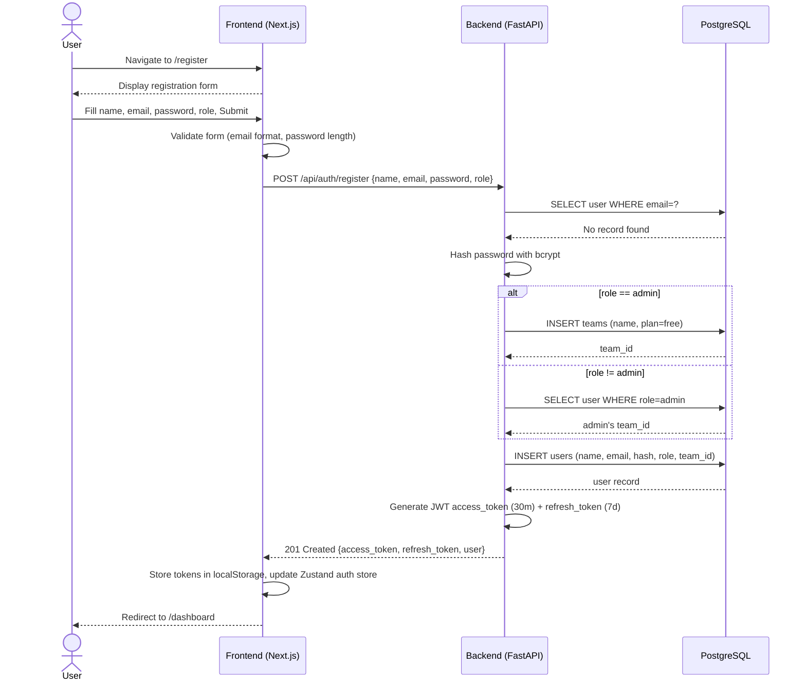
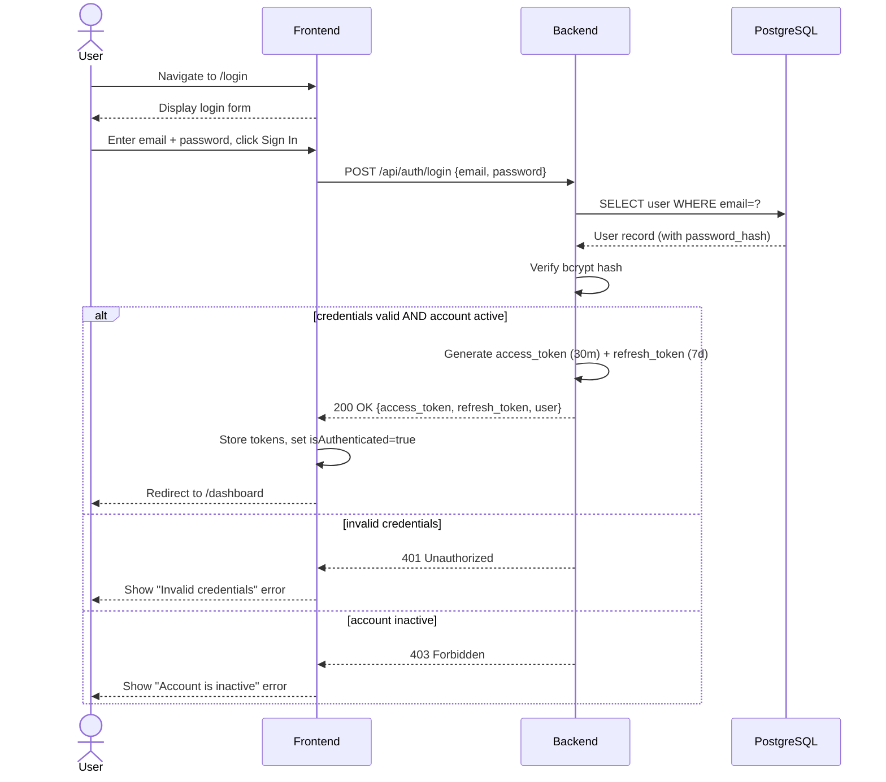
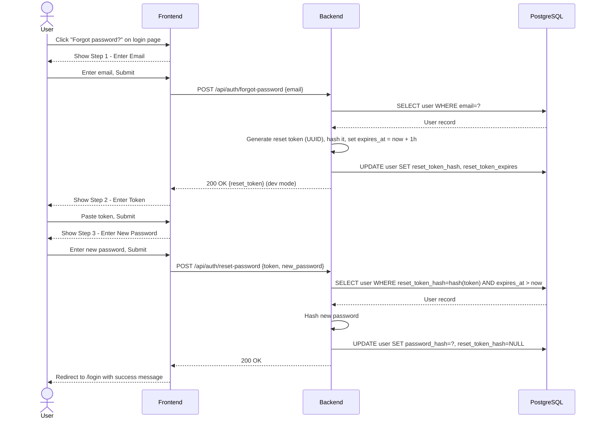

# SYNKRO — Diagram Source Codes (Mermaid)

## Section 1 — Overall Use Case Diagram (Figure 1)

> Insert at: Chapter 2, Section 2.6
flowchart LR

    %% Actors
    subgraph Actors
        A1["Admin"]
        A2["Project Manager"]
        A3["Team Lead"]
        A4["Developer / Senior Dev / Intern"]
    end

    %% System Use Cases
    subgraph System["Synkro System"]
        UC1(["UC-1: Register Account"])
        UC2(["UC-2: Login"])
        UC3(["UC-3: Reset Password"])
        UC4(["UC-4: Upload Meeting Recording"])
        UC5(["UC-5: AI Meeting Processing"])
        UC6(["UC-6: View Meeting Details"])
        UC7(["UC-7: Assign Action Items to Tasks"])
        UC8(["UC-8: Create Task"])
        UC9(["UC-9: Manage Tasks"])
        UC10(["UC-10: Connect Gmail"])
        UC11(["UC-11: Connect Slack"])
        UC12(["UC-12: Connect Jira"])
        UC13(["UC-13: Connect Zoom"])
        UC14(["UC-14: Connect Google Calendar"])
        UC15(["UC-15: AI Chat Query"])
        UC16(["UC-16: View Analytics"])
        UC17(["UC-17: Manage Team Members"])
        UC18(["UC-18: Send Direct Message"])
    end

    %% Admin 
    A1 --> UC1
    A1 --> UC2
    A1 --> UC3
    A1 --> UC4
    A1 --> UC6
    A1 --> UC7
    A1 --> UC8
    A1 --> UC9
    A1 --> UC10
    A1 --> UC11
    A1 --> UC12
    A1 --> UC13
    A1 --> UC14
    A1 --> UC15
    A1 --> UC16
    A1 --> UC17
    A1 --> UC18

    %% Project Manager
    A2 --> UC1
    A2 --> UC2
    A2 --> UC6
    A2 --> UC7
    A2 --> UC8
    A2 --> UC9
    A2 --> UC10
    A2 --> UC11
    A2 --> UC15
    A2 --> UC16
    A2 --> UC18

    %% Team Lead
    A3 --> UC1
    A3 --> UC2
    A3 --> UC6
    A3 --> UC8
    A3 --> UC9
    A3 --> UC10
    A3 --> UC11
    A3 --> UC15
    A3 --> UC16
    A3 --> UC18

    %% Developer
    A4 --> UC1
    A4 --> UC2
    A4 --> UC3
    A4 --> UC6
    A4 --> UC8
    A4 --> UC9
    A4 --> UC10
    A4 --> UC15
    A4 --> UC16
    A4 --> UC18

    %% Relationships
    UC4 -->|include| UC5
    UC7 -->|extend| UC6

---

## Section 2 — System Sequence Diagrams (SSDs) for Each Use Case

### Figure 13 — SSD: UC-1 Register User Account

> Insert at: Chapter 2, Section 2.5.1 (after Table 2.1)

---

### Figure 14 — SSD: UC-2 Login to System

> Insert at: Chapter 2, Section 2.5.2 (after Table 2.2)

---

### Figure 15 — SSD: UC-3 Reset Password

> Insert at: Chapter 2, Section 2.5.3 (after Table 2.3)

---

### Figure 16 — SSD: UC-4 Upload Meeting Recording

> Insert at: Chapter 2, Section 2.5.4 (after Table 2.4)

sequenceDiagram
    actor A as Admin
    participant F as Frontend
    participant B as Backend
    participant S as File Storage
    participant BG as Background Task

    A->>F: Open meetings and click upload
    F-->>A: Show upload form

    A->>F: Enter title and select file
    F->>F: Validate file type and size

    F->>B: Upload meeting recording
    B->>B: Validate file on server

    B->>S: Store recording file
    S-->>B: Return recording URL

    B->>B: Create meeting with processing status
    B->>BG: Start background AI processing

    B-->>F: Created response with meeting id and status

    F->>F: Start polling meeting status
    F-->>A: Show processing indicator

    note over BG: Background task runs AI pipeline

    BG->>B: Update meeting status to completed

    F->>B: Request meeting status
    B-->>F: Return completed data with results

    F-->>A: Show completed status and enable details

---

### Figure 17 — SSD: UC-5 AI Meeting Processing

> Insert at: Chapter 2, Section 2.5.5 (after Table 2.5)

sequenceDiagram
    participant BG as Background Task
    participant S as File Storage
    participant Groq as Groq API
    participant Diar as Diarization Service
    participant DB as PostgreSQL

    BG->>S: Retrieve recording file
    S-->>BG: Return audio data

    rect rgb(230, 240, 255)
        note over BG,Groq: Stage 1 - Transcription
        BG->>Groq: Send audio for transcription
        Groq-->>BG: Return transcript and segments
    end

    rect rgb(230, 255, 230)
        note over BG,Diar: Stage 2 - Speaker Diarization
        BG->>Diar: Perform diarization

        alt local model available
            Diar->>Diar: Run local diarization model
        else cloud service available
            Diar->>Diar: Call cloud diarization API
        else fallback
            Diar->>Groq: Infer speakers using LLM
        end

        Diar-->>BG: Return speaker labeled segments
    end

    rect rgb(255, 245, 220)
        note over BG,Groq: Stage 3 - Context Analysis
        BG->>Groq: Analyze transcript for context and actions
        note right of Groq: Classify utterances and extract tasks
        Groq-->>BG: Return insights and action items
    end

    rect rgb(255, 230, 230)
        note over BG,Groq: Stage 4 - Summarization
        BG->>Groq: Generate meeting summary
        Groq-->>BG: Return summary
    end

    BG->>DB: Update meeting with transcript and summary
    BG->>DB: Store action items with confidence threshold
    DB-->>BG: Data saved

---

### Figure 18 — SSD: UC-6 View Meeting Details

> Insert at: Chapter 2, Section 2.5.6 (after Table 2.6)

sequenceDiagram
    actor U as User
    participant F as Frontend
    participant B as Backend
    participant DB as PostgreSQL

    U->>F: Open meetings list
    F->>B: Request meetings list

    B->>DB: Fetch meetings by team ordered by date
    DB-->>B: Return meetings list

    B-->>F: Send meeting summaries
    F-->>U: Show meeting cards with status

    U->>F: Select a completed meeting
    F->>B: Request meeting details

    B->>DB: Fetch meeting with related action items
    DB-->>B: Return full meeting data

    B-->>F: Send meeting details
    F->>F: Process transcript data
    F->>F: Assign colors to speakers

    F-->>U: Display summary, transcript and action items

---

### Figure 19 — SSD: UC-7 Assign Action Items to Tasks

> Insert at: Chapter 2, Section 2.5.7 (after Table 2.7)

sequenceDiagram
    actor A as Admin or PM
    participant F as Frontend
    participant B as Backend
    participant DB as PostgreSQL

    A->>F: Click assign tasks on meeting page
    F->>B: Request pending assignments

    B->>DB: Fetch pending action items for meeting
    B->>DB: Fetch team users
    B->>B: Match speakers to users

    B-->>F: Return action items with suggested assignees
    F-->>A: Show assignment dialog

    A->>F: Review and confirm assignments
    F->>B: Send bulk assignment request

    loop For each action item
        B->>DB: Create task from action item
        B->>DB: Mark action item as assigned
    end

    B-->>F: Return created tasks
    F-->>A: Show success and update status

---

### Figure 20 — SSD: UC-8 Create Task

> Insert at: Chapter 2, Section 2.5.8 (after Table 2.8)

sequenceDiagram
    actor U as User
    participant F as Frontend
    participant B as Backend
    participant DB as PostgreSQL

    U->>F: Open tasks and click new task
    F-->>U: Show create task form

    U->>F: Enter task details and submit
    F->>F: Validate title is not empty

    F->>B: Send create task request

    B->>B: Set source type and team context
    B->>DB: Verify assignee belongs to team
    DB-->>B: Return user record

    B->>DB: Insert new task
    DB-->>B: Task created

    B-->>F: Return created task
    F->>F: Refresh task list and stats

    F-->>U: Show task in list and close form

---

### Figure 21 — SSD: UC-9 Manage Tasks

> Insert at: Chapter 2, Section 2.5.9 (after Table 2.9)

sequenceDiagram
    actor U as User
    participant F as Frontend
    participant B as Backend
    participant DB as PostgreSQL

    U->>F: Open task edit view
    F-->>U: Show task details in form

    U->>F: Change status and save
    F->>B: Send update task request

    B->>DB: Fetch task by id and team
    DB-->>B: Task record

    B->>B: Check user permissions
    B->>DB: Update task status
    DB-->>B: Updated task

    B-->>F: Return updated task
    F->>F: Refresh task data
    F-->>U: Show updated status

    note over U,DB: Delete flow

    U->>F: Click delete and confirm
    F->>B: Send delete request

    B->>DB: Delete task by id and team
    B-->>F: Deletion success

    F->>F: Refresh task list and stats
    F-->>U: Task removed from list

---

### Figure 22 — SSD: UC-10 Connect Gmail Integration

> Insert at: Chapter 2, Section 2.5.10 (after Table 2.10)

sequenceDiagram
    actor U as User
    participant F as Frontend
    participant B as Backend
    participant IMAP as Gmail IMAP Server
    participant DB as PostgreSQL

    U->>F: Open integrations and select Gmail connect
    F-->>U: Show login dialog

    U->>F: Enter credentials and submit
    F->>B: Send Gmail connection request

    B->>IMAP: Authenticate with Gmail IMAP
    IMAP-->>B: Authentication successful

    B->>DB: Save integration as active
    DB-->>B: Integration created

    B->>IMAP: Fetch recent emails

    IMAP-->>B: Return email list

    loop Sync emails
        B->>IMAP: Fetch email content
        IMAP-->>B: Email data
        B->>DB: Store email if not already saved
    end

    B-->>F: Sync completed with count
    F-->>U: Show Gmail connected and sync success

---

### Figure 23 — SSD: UC-11 Connect Slack Integration

> Insert at: Chapter 2, Section 2.5.11 (after Table 2.11)

sequenceDiagram
    actor U as User
    participant F as Frontend
    participant B as Backend
    participant Slack as Slack OAuth Server
    participant DB as PostgreSQL

    U->>F: Open integrations and select Slack connect

    F->>B: Request Slack authorization
    B->>B: Generate secure state token
    B-->>F: Provide Slack authorization URL

    F-->>U: Redirect to Slack consent screen

    U->>Slack: Approve permissions
    Slack-->>B: Return authorization code and state

    B->>B: Validate state token

    B->>Slack: Exchange code for access token
    Slack-->>B: Return access token and workspace info

    B->>B: Encrypt access token
    B->>DB: Store Slack integration

    B->>B: Start initial message sync

    B-->>F: Redirect to settings page
    F-->>U: Show Slack connected success message

---

### Figure 24 — SSD: UC-12 Connect Jira Integration

> Insert at: Chapter 2, Section 2.5.12 (after Table 2.12)

sequenceDiagram
    actor U as User
    participant F as Frontend
    participant B as Backend
    participant Jira as Jira Cloud API
    participant DB as PostgreSQL

    U->>F: Open integrations and select Jira connect

    F-->>U: Show Jira connection form

    U->>F: Enter domain, email, and API token
    F->>B: Send Jira connection request

    B->>Jira: Validate credentials with user endpoint
    Jira-->>B: Return user details

    B->>B: Encrypt API token
    B->>DB: Store Jira integration data

    B->>Jira: Fetch available projects
    Jira-->>B: Return project list

    B-->>F: Send connected status and projects
    F-->>U: Show Jira connected and project selector

---

### Figure 25 — SSD: UC-13 Connect Zoom Integration

> Insert at: Chapter 2, Section 2.5.13 (after Table 2.13)

sequenceDiagram
    actor U as User
    participant F as Frontend
    participant B as Backend
    participant Zoom as Zoom API
    participant DB as PostgreSQL
    participant BG as Background Task

    U->>F: Open integrations and select Zoom connect

    F->>B: Request Zoom authorization
    B-->>F: Redirect to Zoom consent screen

    U->>Zoom: Approve permissions
    Zoom-->>B: Return authorization code

    B->>Zoom: Exchange code for access token
    Zoom-->>B: Return access and refresh tokens

    B->>DB: Store Zoom integration

    B-->>F: Redirect to settings page

    note over Zoom,BG: Webhook event when recording is ready

    Zoom->>B: Send recording completed event

    B->>B: Verify webhook authenticity

    B->>Zoom: Request recording file
    Zoom-->>B: Return recording data

    B->>DB: Create meeting record with processing status
    B->>BG: Start AI processing pipeline

---

### Figure 26 — SSD: UC-14 Connect Google Calendar Integration

> Insert at: Chapter 2, Section 2.5.14 (after Table 2.14)

sequenceDiagram
    actor U as User
    participant F as Frontend
    participant B as Backend
    participant Google as Google Calendar API
    participant DB as PostgreSQL

    U->>F: Open integrations and select Google Calendar

    F->>B: Request Google authorization
    B-->>F: Redirect to Google consent screen

    U->>Google: Approve calendar permissions
    Google-->>B: Return authorization code

    B->>Google: Exchange code for access token
    Google-->>B: Return tokens and expiry

    B->>B: Encrypt and store tokens
    B->>DB: Save integration settings

    B-->>F: Redirect to settings page

    note over F,DB: Sync task with calendar later

    F->>B: Create task with due date
    B->>DB: Check calendar sync preference
    DB-->>B: Sync enabled

    B->>Google: Create calendar event
    Google-->>B: Return event id

    B->>DB: Link task with calendar event id

### Figure 27 — SSD: UC-15 AI Chat Query

> Insert at: Chapter 2, Section 2.5.15 (after Table 2.15)

sequenceDiagram
    actor U as User
    participant F as Frontend
    participant B as Backend
    participant DB as PostgreSQL
    participant LLM as Groq LLM

    U->>F: Send chat message

    F->>B: Submit chat query

    B->>DB: Fetch overdue tasks
    B->>DB: Fetch recent meetings
    B->>DB: Fetch team users
    B->>DB: Fetch recent emails

    DB-->>B: Return contextual data

    B->>B: Build prompt with context and query

    B->>LLM: Send prompt for response generation
    LLM-->>B: Return answer and suggestions

    B-->>F: Send response and actions

    F-->>U: Display AI response with actions and sources

---

### Figure 28 — SSD: UC-16 View Analytics Dashboard

> Insert at: Chapter 2, Section 2.5.16 (after Table 2.16)

sequenceDiagram
    actor U as User
    participant F as Frontend
    participant B as Backend
    participant DB as PostgreSQL

    U->>F: Open analytics dashboard

    par Load analytics data
        F->>B: Request workload data
    and
        F->>B: Request team workload data
    and
        F->>B: Request productivity trends
    and
        F->>B: Request meeting insights
    end

    B->>DB: Aggregate task statistics
    B->>DB: Compute user workload metrics
    B->>DB: Calculate weekly productivity trends
    B->>DB: Analyze meeting performance

    DB-->>B: Return aggregated analytics data

    B-->>F: Send analytics response

    F->>F: Render charts and insights
    F-->>U: Display analytics dashboard

    U->>F: Click on team member chart
    F->>F: Filter task view by selected user

---

### Figure 29 — SSD: UC-17 Manage Team Members (Admin)

> Insert at: Chapter 2, Section 2.5.17 (after Table 2.17)
sequenceDiagram
    actor A as Admin
    participant F as Frontend
    participant B as Backend
    participant DB as PostgreSQL

    A->>F: Open admin panel

    F->>B: Request user list
    B->>DB: Fetch users for team
    DB-->>B: Return users

    B-->>F: Send user list
    F-->>A: Display user table

    A->>F: Change user role
    F->>B: Update user role request

    B->>DB: Update user role
    DB-->>B: Role updated

    B-->>F: Return updated user
    F-->>A: Show updated role

    A->>F: Toggle user active status
    F->>B: Update user status request

    B->>DB: Toggle user active state
    DB-->>B: Status updated

    B-->>F: Return updated status
    F-->>A: Show status change

    A->>F: Delete user and confirm
    F->>B: Delete user request

    B->>DB: Remove user from system
    B-->>F: Confirm deletion

    F-->>A: Remove user from list

---

### Figure 30 — SSD: UC-18 Send Direct Message

> Insert at: Chapter 2, Section 2.5.18 (after Table 2.18)

sequenceDiagram
    actor U as User
    participant F as Frontend
    participant B as Backend
    participant DB as PostgreSQL
    participant R as Recipient Client

    U->>F: Open messages section

    F->>B: Request team users
    B->>DB: Fetch team members except current user
    DB-->>B: User list
    B-->>F: Return users
    F-->>U: Show user list

    U->>F: Select user and open chat

    F->>B: Request conversation history
    B->>DB: Fetch direct messages between users
    DB-->>B: Message history
    B-->>F: Return messages
    F-->>U: Display chat thread

    U->>F: Send message
    F->>B: Send chat message

    B->>DB: Store message
    DB-->>B: Message saved

    B-->>F: Return new message
    F-->>U: Update chat view

    note over R: Recipient checks for new messages

    R->>B: Request unread messages count
    B->>DB: Count unread messages for user
    DB-->>B: Unread count
    B-->>R: Return unread count
    R->>R: Update notification badge

---

## Section 3 — Domain Model (Figure 4)

> Insert at: Chapter 3, Section 3.1.2

classDiagram

class Team {
    name
    plan
}

class User {
    fullName
    email
    role
    isActive
}

class Meeting {
    title
    scheduledAt
    transcript
    diarizedTranscript
    summary
    status
}

class Task {
    title
    description
    status
    priority
    dueDate
    sourceType
}

class ActionItem {
    description
    confidenceScore
    speakerLabel
    contextType
    status
}

class Integration {
    platform
    isActive
    lastSyncedAt
}

class Email {
    subject
    sender
    bodyPreview
    isRead
    receivedAt
}

class Message {
    content
    platform
    intent
    timestamp
}

class DirectMessage {
    content
    createdAt
    readAt
}

%% Relationships
Team "1" o-- "*" User : has members
Team "1" o-- "*" Meeting : owns
Team "1" o-- "*" Task : owns

User "1" o-- "*" Integration : connects
User "1" o-- "*" Email : receives
User "1" o-- "*" Message : syncs

Meeting "1" *-- "*" ActionItem : produces
ActionItem "0..1" --> "0..1" Task : converted to

User "1" --> "*" Task : assigned to
User "1" --> "*" Task : created by

User "1" --> "*" DirectMessage : sends
User "1" --> "*" DirectMessage : receives

---

## Section 4 — Full Class Diagram (Figure 5)

> Insert at: Chapter 3, Section 3.1.3

classDiagram

class User {
    id
    email
    fullName
    role
    teamId
    isActive
    isVerified
    createdAt
}

class Team {
    id
    name
    plan
    createdAt
}

class Meeting {
    id
    title
    scheduledAt
    transcript
    summary
    status
    teamId
    createdById
}

class Task {
    id
    title
    status
    priority
    dueDate
    sourceType
    assigneeId
    teamId
}

class ActionItem {
    id
    description
    confidenceScore
    status
    meetingId
    taskId
}

class Integration {
    id
    platform
    isActive
    lastSyncedAt
    userId
}

class Email {
    id
    subject
    sender
    receivedAt
    userId
}

class Message {
    id
    content
    platform
    intent
    userId
}

class DirectMessage {
    id
    senderId
    recipientId
    content
    createdAt
}

class CalendarPreference {
    id
    userId
    autoSyncTasks
    autoSyncMeetings
    createdAt
}

%% Core structure
Team "1" --> "*" User
Team "1" --> "*" Meeting
Team "1" --> "*" Task

User "1" --> "*" Task
User "1" --> "*" Integration
User "1" --> "*" Email
User "1" --> "*" Message
User "1" --> "*" Meeting
User "1" --> "0..1" CalendarPreference

Meeting "1" --> "*" ActionItem
ActionItem "*" --> "0..1" Task

User "1" --> "*" DirectMessage : sender
User "1" --> "*" DirectMessage : receiver

---

## Section 5 — Sequence Diagrams (Key Flows)

### Figure 9 — Meeting AI Processing Pipeline (Detailed)

> Insert at: Chapter 3, Section 3.2.1

sequenceDiagram

    participant Router as Meetings Router
    participant BG as Background Worker
    participant AI as AI Service
    participant Diar as Diarization Service
    participant Analysis as Analysis Service
    participant LLM as LLM API
    participant DB as Database

    Router->>BG: Start meeting processing task

    BG->>DB: Fetch meeting record

    BG->>AI: Transcribe audio

    alt Primary transcription available
        AI->>LLM: Transcribe audio
        LLM-->>AI: Return transcript
    else Fallback transcription
        AI->>LLM: Use fallback model
        LLM-->>AI: Return transcript
    end

    AI-->>BG: Transcript + segments

    BG->>Diar: Perform speaker diarization

    alt ML diarization available
        Diar->>Diar: Run speaker model
        Diar-->>BG: Labeled speech segments
    else API diarization available
        Diar->>LLM: External diarization API
        LLM-->>Diar: Speaker segments
        Diar-->>BG: Labeled segments
    else LLM fallback
        Diar->>LLM: Infer speakers from text
        LLM-->>Diar: Speaker mapping
        Diar-->>BG: Labeled segments
    end

    BG->>Analysis: Analyze meeting content

    Analysis->>LLM: Extract insights and action items
    LLM-->>Analysis: Structured insights

    Analysis-->>BG: Enriched meeting data

    BG->>AI: Generate meeting summary

    AI->>LLM: Summarization request
    LLM-->>AI: Summary text

    AI-->>BG: Final summary

    BG->>DB: Save transcript, summary, and metadata

    loop Store action items
        BG->>DB: Insert action item
    end

    DB-->>BG: Processing complete

### Figure 10 — User Authentication Flow (Detailed)

> Insert at: Chapter 3, Section 3.2.2
sequenceDiagram

    participant U as Browser
    participant S as Auth Store
    participant API as API Client
    participant B as Backend
    participant DB as Database

    U->>S: Initialize app state
    S->>S: Read token from storage

    S->>API: Request current user
    API->>B: Send authenticated request

    B->>B: Validate access token
    B->>DB: Fetch user data
    DB-->>B: User record

    B-->>API: Return user data
    API-->>S: Update auth state

    note over U,DB: Token expires during session

    U->>API: Make API request
    API->>B: Request with expired token

    B-->>API: Unauthorized response

    API->>B: Request token refresh
    B->>B: Validate refresh token
    B-->>API: Issue new access token

    API->>API: Update stored token
    API->>API: Retry original request

    API->>B: Retry request with new token
    B-->>API: Successful response
    API-->>U: Return data

---

### Figure 12 — AI Chat Query Flow (Detailed)

> Insert at: Chapter 3, Section 3.2.3

sequenceDiagram
    actor U as User
    participant F as Chat Page (Frontend)
    participant B as chat.py Router
    participant Task as tasks.py service
    participant Meet as meetings.py service
    participant LLM as ai_service.py
    participant Groq as Groq API
    participant DB as PostgreSQL

    U->>F: Navigate to Chat, type query, press Send
    F->>B: POST /api/chat/query {message: "What are overdue tasks?"}
    B->>B: get_current_user(token) -> user, team_id

    par Context gathering (parallel DB queries)
        B->>DB: SELECT tasks WHERE team_id=? LIMIT 50 ORDER BY due_date
        DB-->>B: tasks[]
    and
        B->>DB: SELECT meetings (summary only) WHERE team_id=? ORDER BY created_at DESC LIMIT 5
        DB-->>B: meetings[]
    and
        B->>DB: SELECT users WHERE team_id=?
        DB-->>B: users[]
    and
        B->>DB: SELECT emails WHERE user_id=? ORDER BY received_at DESC LIMIT 10
        DB-->>B: emails[]
    end

    B->>B: Serialize context to compact string representations
    B->>LLM: chat_with_context(user_message, context_data)
    LLM->>Groq: POST /v1/chat/completions (model: llama-3.3-70b-versatile)
    Groq-->>LLM: {answer, context_used, suggested_actions}
    LLM-->>B: structured response
    B-->>F: 200 OK {response: answer, sources: [...], actions: [...]}

    F->>F: Append AI message bubble
    F->>F: Show source chips (e.g., "Tasks: 12")
    F->>F: Render action buttons (e.g., "View Overdue Tasks")
    F-->>U: AI response displayed

---

## Section 6 — System Architecture + Component Interaction Diagrams (Figures 2 & 8)

### Figure 2 — System Architecture Diagram

> Insert at: Chapter 3, Section 3.3

flowchart TB
    subgraph Client["Presentation Layer - Browser"]
        Next["Next.js 14 App Router\nTypeScript + Tailwind CSS"]
        Zustand["Zustand Stores\n(auth, theme)"]
        TQ["TanStack Query\n(server state + caching)"]
        Axios["Axios HTTP Client\nJWT interceptor + refresh"]
    end

    subgraph Backend["Business Logic Layer - FastAPI (port 8000)"]
        Routers["12 Routers\nauth, tasks, meetings, chat, integrations, analytics, admin, emails, messages, direct_messages, calendar, slack_webhooks"]
        Services["10 Service Modules\nAI, diarization, meeting analysis, Slack, Jira, Zoom, Gmail, Calendar"]
        Models["SQLAlchemy ORM Models\n10 models + Alembic migrations"]
        Auth["JWT Authentication\nPyJWT + bcrypt + Fernet"]
        BG["Background Tasks\nMeeting AI pipeline"]
    end

    subgraph DataLayer["Data Layer"]
        PG[("PostgreSQL 14+\nasyncpg + JSONB")]
        FS["File Storage\nLocal / AWS S3 / Cloudinary"]
    end

    subgraph AI["AI Services Layer"]
        GroqW["Groq Whisper\nLarge-v3-Turbo"]
        GroqL["Groq Llama 3.3 70B"]
        OAI["OpenAI Fallback\nGPT-4 / Whisper"]
        Pyannote["pyannote.audio\nLocal diarization"]
        Assembly["AssemblyAI\nCloud diarization"]
    end

    subgraph Integrations["External Integration Layer"]
        Slack["Slack API\nOAuth2 + Webhooks"]
        Jira["Jira Cloud REST\nAPI Token Auth"]
        Zoom["Zoom API\nOAuth2 + Webhooks"]
        Gmail["Gmail IMAP\nApp Password SSL"]
        GCal["Google Calendar API\nOAuth2"]
    end

    Client <-->|REST API JSON HTTPS| Backend
    Backend <-->|asyncpg SQL queries| DataLayer
    Backend -->|File upload/download HTTPS| FS
    Backend -->|Transcription + LLM inference| AI
    Backend -->|OAuth + Webhooks + Sync| Integrations

---

### Figure 8 — Component Interaction Diagram

> Insert at: Chapter 3, Section 3.5

flowchart LR
    subgraph FE["Frontend Components"]
        Dashboard["Dashboard Page"]
        MeetingPage["Meeting Detail Page"]
        TaskPage["Tasks Page"]
        ChatPage["Chat Page"]
        AnalyticsPage["Analytics Page"]
        SettingsPage["Settings / Integrations"]
        CalendarPage["Calendar Page"]
        EmailPage["Emails Page"]
        DmPage["Messages / DMs Page"]
    end

    subgraph BE_Routers["Backend Routers"]
        AuthR["auth.py"]
        MeetR["meetings.py"]
        TaskR["tasks.py"]
        ChatR["chat.py"]
        AnalytR["analytics.py"]
        IntR["integrations.py"]
        AdminR["admin.py"]
        WebhookR["slack_webhooks.py"]
        CalR["calendar.py"]
        EmailR["emails.py"]
        DmR["direct_messages.py"]
    end

    subgraph BE_Services["Backend Services"]
        AISvc["ai_service.py\ntranscription, LLM, chat"]
        DiarSvc["diarization_service.py"]
        MeetSvc["meeting_analysis_service.py"]
        SlackSvc["slack_service.py"]
        JiraSvc["jira_service.py"]
        ZoomSvc["zoom_service.py"]
        GmailSvc["gmail_service.py"]
        GCalSvc["google_calendar_service.py"]
        Security["security.py\nJWT, bcrypt, Fernet"]
    end

    %% Frontend -> Backend Routers
    Dashboard -->|"task stats, meetings"| TaskR
    Dashboard -->|"recent meetings"| MeetR
    MeetingPage -->|"meeting detail"| MeetR
    MeetingPage -->|"bulk assign"| MeetR
    TaskPage -->|"CRUD, filters, stats"| TaskR
    ChatPage -->|"query"| ChatR
    AnalyticsPage -->|"workload, trends"| AnalytR
    SettingsPage -->|"integrations CRUD"| IntR
    SettingsPage -->|"admin users"| AdminR
    CalendarPage -->|"events, sync"| CalR
    EmailPage -->|"sync, list, stats"| EmailR
    DmPage -->|"users, conversations, send"| DmR

    %% Routers -> Services
    MeetR --> AISvc
    MeetR --> DiarSvc
    MeetR --> MeetSvc
    IntR --> SlackSvc
    IntR --> JiraSvc
    IntR --> ZoomSvc
    IntR --> GmailSvc
    IntR --> GCalSvc
    CalR --> GCalSvc
    EmailR --> GmailSvc
    AuthR --> Security
    TaskR --> Security
    MeetR --> Security
    WebhookR --> SlackSvc

    %% Services -> External APIs
    AISvc --> GroqAPI["Groq API"]
    DiarSvc --> AssemblyAI["AssemblyAI"]
    SlackSvc --> SlackAPI["Slack API"]
    JiraSvc --> JiraAPI["Jira Cloud"]
    ZoomSvc --> ZoomAPI["Zoom API"]
    GmailSvc --> GmailIMAP["Gmail IMAP"]
    GCalSvc --> GoogleCal["Google Calendar API"]

---

## Section 7 — Data Flow Diagrams (Figures 6 & 7)

### Figure 6 — DFD Context Level 0

> Insert at: Chapter 3, Section 3.1 (or after System Architecture)

flowchart TD
    Admin(["Admin"])
    User(["Team Member\nPM / Lead / Dev / Intern"])

    SlackExt(["External: Slack Workspace"])
    JiraExt(["External: Jira Cloud"])
    ZoomExt(["External: Zoom"])
    GmailExt(["External: Gmail"])
    GCalExt(["External: Google Calendar"])
    GroqExt(["External: Groq AI API"])

    SYNKRO["SYNKRO\nWorkspace Orchestration System"]

    %% Admin interactions
    Admin -->|"upload meeting recording"| SYNKRO
    Admin -->|"user management"| SYNKRO
    SYNKRO -->|"transcripts, summaries, action items"| Admin
    SYNKRO -->|"team analytics, user data"| Admin

    %% User interactions
    User -->|"tasks, chat queries"| SYNKRO
    SYNKRO -->|"tasks, analytics, AI responses"| User

    %% Slack integration
    SlackExt -->|"OAuth token, messages, DMs"| SYNKRO
    SYNKRO -->|"sync status"| SlackExt

    %% Jira integration
    JiraExt -->|"projects, issue status"| SYNKRO
    SYNKRO -->|"create/update issues"| JiraExt

    %% Zoom integration
    ZoomExt -->|"webhooks, recordings"| SYNKRO
    SYNKRO -->|"recording requests"| ZoomExt

    %% Gmail integration
    GmailExt -->|"emails via IMAP"| SYNKRO

    %% Google Calendar integration
    GCalExt -->|"events, OAuth"| SYNKRO
    SYNKRO -->|"create/update events"| GCalExt

    %% AI integration
    SYNKRO -->|"audio for transcription"| GroqExt
    GroqExt -->|"transcripts, summaries, LLM output"| SYNKRO

---

### Figure 7 — DFD Level 1

> Insert at: Chapter 3, Section 3.1 (after DFD Level 0)

flowchart TD
    Admin(["Admin"])
    User(["Team Member"])

    SlackExt(["Slack"])
    ZoomExt(["Zoom"])
    GmailExt(["Gmail"])
    GroqExt(["Groq AI API"])
    GCalExt(["Google Calendar"])
    JiraExt(["Jira Cloud"])

    DB_Users[("Users DB")]
    DB_Meetings[("Meetings DB")]
    DB_Tasks[("Tasks DB")]
    DB_Integrations[("Integrations DB")]
    DB_Emails[("Emails DB")]
    DB_Messages[("Messages DB")]
    DB_ActionItems[("Action Items DB")]

    P1["1.0 User Auth & Management"]
    P2["2.0 Meeting Processing"]
    P3["3.0 Task Management"]
    P4["4.0 Integration Sync"]
    P5["5.0 AI Chat Assistant"]
    P6["6.0 Analytics Engine"]

    %% Authentication
    Admin --> P1
    User --> P1
    P1 <-->|users| DB_Users

    %% Meeting pipeline
    Admin --> P2
    ZoomExt --> P2
    P2 --> GroqExt
    GroqExt --> P2
    P2 --> DB_Meetings
    P2 --> DB_ActionItems

    %% Task management
    User --> P3
    DB_ActionItems --> P3
    P3 <-->|tasks| DB_Tasks
    P3 --> JiraExt

    %% Integration sync
    SlackExt --> P4
    GmailExt --> P4
    GCalExt --> P4
    P4 <-->|integrations| DB_Integrations
    P4 --> DB_Emails
    P4 --> DB_Messages
    P4 --> GCalExt

    %% AI Chat
    User --> P5
    DB_Tasks --> P5
    DB_Meetings --> P5
    DB_Emails --> P5
    P5 --> GroqExt
    GroqExt --> P5
    P5 --> User

    %% Analytics
    DB_Tasks --> P6
    DB_Meetings --> P6
    DB_Users --> P6
    P6 --> User
    P6 --> Admin

---

## Section 8 — Entity-Relationship Diagram (Figure 3)

> Insert at: Chapter 3, Section 3.1.1

erDiagram
    TEAMS {
        uuid id PK
        string name
        string plan
        json settings
        timestamp created_at
    }

    USERS {
        uuid id PK
        string email UK
        string password_hash
        string full_name
        string role
        uuid team_id FK
        string avatar_url
        string timezone
        boolean is_active
        boolean is_verified
        string password_reset_token
        timestamp password_reset_expires
        timestamp created_at
        timestamp updated_at
    }

    MEETINGS {
        uuid id PK
        string title
        timestamp scheduled_at
        int duration_minutes
        string recording_url
        text transcript
        json diarized_transcript
        json speaker_names
        text summary
        string status
        string zoom_meeting_id
        string calendar_event_id
        string google_meet_link
        uuid team_id FK
        uuid created_by_id FK
        timestamp created_at
    }

    TASKS {
        uuid id PK
        string title
        text description
        string status
        string priority
        timestamp due_date
        int estimated_hours
        string source_type
        string source_id
        string external_id
        string calendar_event_id
        timestamp calendar_synced_at
        uuid assignee_id FK
        uuid created_by_id FK
        uuid team_id FK
        timestamp created_at
        timestamp updated_at
    }

    ACTION_ITEMS {
        uuid id PK
        text description
        string assignee_mentioned
        string deadline_mentioned
        float confidence_score
        string status
        string speaker_label
        string assigned_by
        string context_type
        uuid meeting_id FK
        uuid message_id FK
        uuid task_id FK
        timestamp created_at
    }

    INTEGRATIONS {
        uuid id PK
        string platform
        text access_token
        text refresh_token
        timestamp expires_at
        string scope
        boolean is_active
        json platform_metadata
        timestamp last_synced_at
        uuid user_id FK
        timestamp created_at
    }

    EMAILS {
        uuid id PK
        string gmail_message_id
        string subject
        string sender
        string to_address
        string body_preview
        text body
        timestamp received_at
        boolean is_read
        boolean is_flagged
        string ai_classification
        text ai_summary
        uuid user_id FK
        uuid integration_id FK
        timestamp created_at
    }

    MESSAGES {
        uuid id PK
        string external_id
        string platform
        string sender_email
        string sender_name
        text content
        timestamp message_timestamp
        string thread_id
        string channel_id
        string channel_type
        boolean processed
        string intent
        json entities
        uuid user_id FK
    }

    DIRECT_MESSAGES {
        uuid id PK
        uuid sender_id FK
        uuid recipient_id FK
        text content
        timestamp read_at
        string slack_ts
        timestamp created_at
    }

    CALENDAR_PREFERENCES {
        uuid id PK
        uuid user_id FK
        boolean auto_sync_tasks
        boolean auto_sync_meetings
        boolean auto_sync_actions
        json reminder_urgent_minutes
        json reminder_high_minutes
        json reminder_medium_minutes
        json reminder_low_minutes
        boolean daily_digest_enabled
        string daily_digest_time
        boolean auto_reschedule_overdue
        timestamp created_at
        timestamp updated_at
    }

    TEAMS ||--o{ USERS : has_members
    TEAMS ||--o{ MEETINGS : owns
    TEAMS ||--o{ TASKS : owns

    USERS ||--o{ MEETINGS : creates
    USERS ||--o{ TASKS : creates
    USERS ||--o{ TASKS : assigned_to
    USERS ||--o{ INTEGRATIONS : connects
    USERS ||--o{ EMAILS : receives
    USERS ||--o{ MESSAGES : syncs
    USERS ||--o{ DIRECT_MESSAGES : sends
    USERS ||--o{ DIRECT_MESSAGES : receives
    USERS ||--o| CALENDAR_PREFERENCES : has

    MEETINGS ||--o{ ACTION_ITEMS : produces
    MESSAGES ||--o{ ACTION_ITEMS : produces
    ACTION_ITEMS ||--o| TASKS : converts_to

    INTEGRATIONS ||--o{ EMAILS : fetches

---

